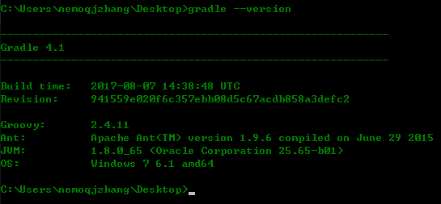
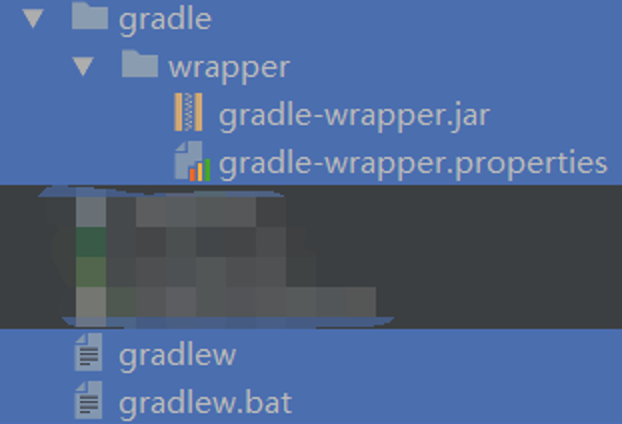
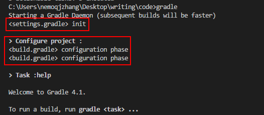
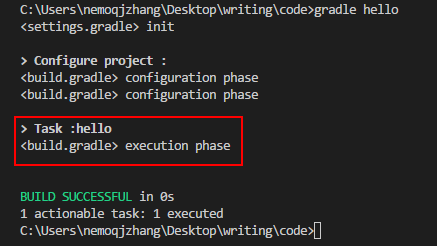

## Groovy 入门 ##
>随着Android/Gradle的发展，Groovy渐渐的被更多Android开发者熟知。

Groovy也是基于JVM的语言之一，语法和Java非常相似（对Android/Java开发者来说学习成本很低，这也是Gradle为什么选择Groovy作为脚本语言的原因）。同时它是一门脚本语言，`.groovy`的脚本代码会先被编译成Java字节码（也就是`.class`文件），然后由Java虚拟机执行。

>Groovy是一门**动态强类型**语言。

关于动态/静态、强类型/弱类型语言，可以参考[这个回答](https://www.zhihu.com/question/19918532)。
简单理解：Groovy在运行时做类型检查（动态语言），并且和Java一样对类型转换偏向于显示（强类型）。

不废话了，下边介绍Groovy的基础。

### 1.安装 ###
Windows平台可以去[这里](http://groovy-lang.org/download.html)下载Groovy的zip包，解压之后把bin目录添加到环境变量即可。

Linux/macOS平台官方推荐使用SDKMAN工具安装Groovy。具体命令行命令如下：

`$ curl -s get.sdkman.io | bash`  
`$ source "$HOME/.sdkman/bin/sdkman-init.sh"`  
`$ sdk install groovy`  
`$ groovy -version`

更详细的信息就不搬移了，参考上边的下载链接页面内容即可。  
安装完成之后，找个目录，新建hello.groovy文件，并添加一行代码：
```groovy
println "hello groovy"
```
在该目录下打开终端（命令行），执行命令`groovy hello.groovy`，看到屏幕上输出的`hello groovy`表示安装就大功告成了。

### 2.语法 ###
Groovy与Java最大的不同是实现了动态类型语言的特性，让代码编写和写脚本一样简单（实际上Groovy就是脚本语言）。
#### 2.1 关键字 ####
官方文档中贴出的关键字有：
| <font color=#ff0000>**as**</font> | assert | break | case |
| :---: | :---: | :---: | :---: |
| **catch** | **class** | **const** | **continue** |
| <font color=#ff0000>**def**</font> | **default** | **do** | **else** |
| **enum** | **extends** | **false** | **finally** |
| **for** | **goto** | **if** | **implements** |
| **import** | <font color=#ff0000>**in**</font> | **instanceof** | **interface** |
| **new** | **null** | **package** | **return** |
| **throws** | <font color=#ff0000>**trait**</font> | **true** | **try** |
| **while** |  |  |  |

其中被标红的`as/def/in/trait`是Java中没有的（其他的参看Java关键字含义，基本完全一致）。

<font color=#ff0000>**as**</font>  
`as`关键字有两个作用：**显示的类型强转**和**导包的别名**
```groovy
def a = "123"
def b = a as int

import java.util.Date
import java.sql.Date as SQLDate
```
<font color=#ff0000>**def**</font>   
`def`关键字用于声明类型不确定的变量或者返回值类型不确定的函数。  
`def a = 10`  
定义变量a的值为10，a的类型不确定（可以理解为是Object类型）。在Groovy中声明变量一般就使用def去定义，也可以不使用def注明，直接给标识符幅值：`b = 10`，此时变量b的作用域为整个脚本文件，而使用def定义的变量a可以理解为是一个局部变量。  

<font color=#ff0000>**in**</font>  
`in`关键字用于**for each语句**和**判断包含关系**：
```groovy
//用于遍历
def list = [1,2,3,4]
for (item in list) {
    println item
}

//用于判断包含关系
assert (3 in list)
```
<font color=#ff0000>**trait**</font>   
`trait`关键字是groovy对java面向对象的扩展，有点和Java8 interface的default方法类似，用`trait`标识的类，可以看做是一个同时包含实现以及方法声明的接口。这部分详细内容有兴趣可参考[官方文档](http://groovy-lang.org/objectorientation.html#_traits)。  
#### 2.2 标识符 ####
Groovy中普通的标识符说起来和Java系是一致的：由**字母**、**美元符**、**数字**和**下划线**组成，且数字**不**能是第一位。  
然而，对于`map`类型的key，却可以很奇怪：
```groovy
def foo = [this:'a']
foo.class = 1
println foo.class
println foo.this
```
以上都是合法的。  
更过分的是还有一种引用标识符（这样子：`person."name"`），被引号包含的内容可以是任意字符串。
```groovy
def map = [:]
map."*&^%#\$@" = "haha"
assert map."*&^%#\$@" == "haha"
```
其中\\$是为了转义"$"。

#### 2.3 字符串 ####
Groovy中字符串有两类：<font color=#ff0000>java.lang.String</font>和<font color=#ff0000>groovy.lang.GString</font>。第一类不用多说，就是Java中的字符串；第二类是可**插值**字符串。
以上是从JVM的角度以对象的类来区分不同的字符串，在groovy中字符串形式很多：  
```groovy
'I am a string'

"I am a string"

''' I
am a string '''

"""I am a 
string"""

/I am a string/

$/I am a string/$
```
以上都是Groovy中的合法字符串。那么，他们是java.lang.String还是groovy.lang.GString？GString有什么特点呢？

##### GString #####
GString是指被`"..."`  `"""..."""`  `/.../`  `$/.../$`包裹的且有插值行为的字符串。也就是单引号包裹的字符串都是普通类型的，它本身也不支持插值操作；另外，字符串中有插值行为是该字符串对象才会被认为是GString对象。  
字符串中的插值行为如下：
```groovy
def str = "hello my ${'frient'}"
def str_a = /a ${str}/
```
即使用`${}`包裹可变部分，这样整个字符串即是一个值可变的插值字符串。
##### /.../ 和 $/.../$ #####
这两类字符串是为了在某些特定情况下方便使用而出现。
- `/.../`中转义字符是"/"，也仅有"/"字符需要转义，其他字符都不需要转义，在写正则表达式时比较实用
- `$/.../$`中转义字符是"$",也仅有"$"字符需要转义，其他字符都不需要转义，适用于需要在字符串中写一些需要转义的字符而不想写转义符的场景（好像是屁话）。

官网总结表格如下：
|字符串类型 | 字符串语法 | 是否可插值 | 是否支持多行 | 转移符 |
| :---: | :---: | :---: | :---: | :---: |
| 单引号字符 | `'...'` | 否 | 否 | `\` |
| 多行单引号字符 | `'''...'''` | 否 | 是 | `\` |
| 双引号字符 | `"..."` | 是 | 否 | `\` |
| 多行双引号字符 | `"""..."""` | 是 | 是 | `\` |
| 斜杠字符 | `/.../` | 是 | 是 | `\` |
| 美元符斜杠字符 | `$/.../$` | 是 | 是 | `$` |

Groovy中字符安和Java字符串最大的区别就是它支持插值操作，可以在字符串中嵌入一些变量的值，这在脚本编写时会比较方便实用。
#### 2.4 数字 ####  
Groovy中有关于数字的操作和Java也基本是一致的，涉及到的类型也都是Java中数字操作相关的类型（`byte/char/short/int/long/float/double/BigInteger/BigDecimal`）。  
注意以下几点：
- 连续的两个`*`表示次方运算：`2 ** 3 = 8`
- 除法`/`不再是`Java`中的整数除法，它得到的结果是`double`（除数或被除数是float或者double）或者`BigDecimal`(除数和被除数是其他类型)，实现Java中的整数除法需要使用intdiv()函数:  
`8/3 = 2.6666666...`  
`8.intdiv(3) = 2`
- 数字太长可以用下划线隔开：`long bigNum = 8_123_324_123_423_454_586L`(并非强制要三个一组)  
#### 2.5 集合 ####
Groovy中的集合也是基于Java的集合API实现，分为：List、Array和Map三类。
集合的定义使用方括号：
```groovy
def list = [1,2,3]
assert list instanceof java.util.ArrayList

def array = [1,2,3] as int[]

def map = [red:"0xff0000", green:"0x00ff00", blue:"0x0000ff"]
assert list instanceof java.util.LinkedHashMap
```
对集合的操作很方便，也很好理解：
```groovy
assert list[-1] == 3
assert list[0,2] == [1,3]
assert list[1 .. 2] == [2,3]

assert arrary[1] == 2

assert map.red == "0xff0000"
assert map."blue" == "0x0000ff"
assert map['green'] == "0x00ff00"

```


Groovy的基础语法和Java没有太大区别，对于熟悉Java的同学来说，很好上手也容易理解（毕竟是个脚本语言）。

### 3.闭包 ###
闭包是Groovy区别于Java的核心，也是用于实现Gradle DSL风格配置块的语言基础。  
官网中对于闭包的定义描述很全面：**Groovy中的闭包是一个开放、匿名的代码块，它可以接收参数，可以返回值也可以把它作为值赋给某个变量**。  
对于熟悉Js/python的同学来说，闭包概念应该不陌生，这里假设我们只是一个小小的Java程序员，完全不了解闭包。
#### 闭包格式 ####
语言的特性都会体现在其编码方式和输出结果上，groovy中的闭包也不例外。  
groovy的闭包格式如下：
```groovy
{params -> statements}
```
闭包由花括号包裹，括号内包含参数列表和代码块两部分，并用`->`隔开。其中参数列表和`->`可以缺省(其实除了花括号，你可以什么都不写，但这样好像没什么意义)。
#### 闭包定义 ####
了解基本的格式之后，我们跃跃欲试。
看如下的闭包定义：
```groovy
def c1 = {int x -> println x}
def c2 = {String x, int y -> println "x:${x}, y:${y}"}
def c3 = { -> println x}
def c4 = {println x}
def c5 = {println it}

def empty = {}
```
且不论这些闭包调用时会不会出错，这样定义是完全OK的，而且他们的类型都是Closure。  
和闭包格式说明一致，闭包中的内容都可以缺省。`c1`和`c2`属于那种五脏俱全的；`c3`缺省了参数列表，表示它一个参数都没有；`c4`和`c5`省略了参数列表**和分隔符

#### 闭包调用 ####
别光定义啊，你倒是用一下啊。
闭包的调用方式有很多，我们先用一种面向对象的方式来调用：
```groovy
c1.call(1)
c2.call("1",1)
//c3.call(1) x未定义，调用异常
//c4.call(1) x未定义，调用异常
c5.call(1)
```
闭包是一个对象，它有用call方法，我们调用call方法，并根据闭包定义参数列表传入相应的参数既可调用这个闭包，来执行闭包中定义的代码块。  
从上边的例子还可以看出一点：c5可以被正常的调用，因为**it**是一个**默认的参数**，当然像c3这种显示定义参数列表为空的情况没有默认参数it。  
继续看花式调用方式：
```groovy
c1(1)//有点像函数调用
c1 1 //有没有看出gradle配置的影子？？
//c1 "1" "1"不是int类型，因此调用失败

c2("1",1)
//c2 "1",1 不要括号的调用仅限一个参数的闭包
```

#### 闭包的返回值 ####
类似于方法调用，闭包调用之后是有返回值的，只是我们定义闭包时并不会指定闭包的返回值。
```groovy
def c = {int x -> return x+1}
def c_1 = {int x -> x+1}
def c_2 = {int x -> println x+1}
assert c(1) == 2
assert c_1(1) == 2
assert c_2(1) == null
```
从示例也可以看出：闭包的返回值可以显示的用return语句执行（类型不限），没有return语句时，默认返回最后一行代码的值（println函数返回值类型为void，因此在c_2中我们得到null）。

#### 闭包是一个对象 ####  
如题，这个其实也不需要再强调，但是如果不熟悉闭包，当代码把它当做一个对象处理时，有可能会让人觉得迷糊：
```groovy
def a = {Closure c ->
    c.call()
}

a {
    println "I am from closure"//花括号表示一个闭包，它作为参数传给了闭包a
}
```
a是一个闭包，调用时传入一个闭包作为参数（是不是渐渐地看到了Gradle的样子）。同理，函数也一样：
```groovy
def a(Closure c){
    c.call()
}

a {
    println "I am from closure"//花括号表示一个闭包，它作为参数传给了闭包a
}
```
习惯这种写法，就很好理解Gradle中那种DSL配置风格。


这么来看闭包是不是挺简单的，当做一个对象即可，调用方式多看几遍也就熟悉了。  

#### 代理策略 ####
如上，闭包的格式并不复杂，然而像静态内部类一样，它会持有外部类的引用；同时它还有代理字段，这使得闭包的行为变得多样。  
比静态内部类更进一步，groovy闭包会持有：`this`、`owner`和`delegate`三个隐式对象，他们分别指向不同的对象，我们一个一个分析。

**this**  
this指向闭包定义时所在的离闭包最近的类的实例。
一切都是对象，不仅适用于java，也适用于groovy。因此，闭包的定义必然在某个类当中。看如下示例：
```groovy
class A {
    void run() {
        def closure_1 = {this}//此处的this是闭包closure_1的this对象
        assert closure_1() == this//此处的this是类A的this对象
    }
}
def a = new A()
a.run()
```
断言成功，说明闭包中的this确实是指向它所处的类的那个实例（除了显示使用this对象外，还可以在闭包内调用getThisObject()方法获得闭包的this对象）。

**owner**  
owner指向闭包定义时所在的离闭包最近的**类或者闭包**的示例。
闭包除了可能定义在某个类中，还可能会在闭包内，这个owner即是指向离本闭包最近的那个类或者闭包。
是不是很绕？是不是看代码更简单？好的我们直接看代码：
```groovy
class A {
    void run() {
        def closure_1 = {
            def clousre_2 = {owner}//此处的owner是闭包closure_2的owner对象,它指向闭包closure_1
            return clousre_2
        }
        assert closure_1()() == closure_1//调用闭包closure_1()得到闭包clousre_2，再次调用闭包clousre_2得到闭包clousre_2的owner对象

        assert closure_1.getThisObject() == this//this对象逻辑如上节

        assert closure_1().getOwner() == closure_1//调用闭包closure_1()得到闭包clousre_2,调用闭包clousre_2的getOwner方法得到它的owner对象
    }
}
def a = new A()
a.run()
```
一切尽在代码中(要理解闭包的返回值以及this/owner的指向关系)...  

**delegate**  
确切的说，delegate是闭包的一个扩展字段。  
本节的小标题为代理策略，说的就是给闭包设置不同的代理方式，它的delegate字段会指向不同的对象。默认情况下delegate指向owner字段。  既然默认情况是指向owner，那么它肯定也是可以指向this.另外，如果我们手动的给闭包的delegate字段赋值，它也可以指向一个八竿子打不着的对象。  
那么，给delegate字段指来指去有什么用呢？好玩吗？  
delegate字段可以辅助解析闭包内解析不出的内容（和owner功能一样，类似于Java中的匿名内部类持有外部类的引用，在匿名内部类中可以直接使用外部类的内容），我们暂且把owner、delegate的这种辅助闭包解析的行为叫做**解析扩展**。什么意思呢，比如闭包的statement中引用了name变量，但是闭包内并没有定义name变量，这时如果delegate字段中定义了name变量，那闭包中引用name就不会出错：
```groovy
def name = "haha"
def closure = {
    //可以正常调用，因为delegate指向owner，
    //owner指向脚本所在的类，脚本所在的类有name字段
    println name 
}
closure()
```
我们还可以把delgate指向一个自定义的对象，在闭包内就可以调用到这个自定义对象的内容：
```groovy
class B {
    def name = "haha"
}
def closure = {
    //默认情况下delegate=owner，无法调用到name字段
    //手动把delegate指向B的实例之后就可以正常使用name字段
    println name 
}
closure.delegate = new B()
closure()
```

掌握这一点对理解Groovy闭包很重：闭包默认可以引用外部的一些变量，是因为存在delegate字段；这个字段指向不同，闭包内的行为就可以不一样。

**代理策略**  
从上边的分析可以看出，闭包的owner/delegate字段都可以用来辅助解析闭包。当闭包内的某个方法或字段解析不到时，可以尝试通过owner/delegate解析。  
闭包的代理策略即用于控制该闭包以何种策略来进行解析扩展。比如：设置为只用owner解析、只用delegate、优先用delegate或者是优先用owner。  
代码中使用闭包的`resolveStrategy`字段来选择代理策略，具体的代理策略有（默认为OWNER_FIRST）：
```groovy
Closure.OWNER_FIRST//优先使用owner
Closure.DELEGATE_FIRST//优先使用delegate
Closure.OWNER_ONLY//只使用owner
Closure.DELEGATE_ONLY//只使用delegate

Closure.TO_SELF//既不是使用owner,也不使用delegate,在定义自己的Closure类型时可能有用
```
如上示例，如果我们把闭包`closure`的代理策略改为只使用Owner，那么它将解析不到`name`字段：
```groovy
class B {
    def name = "haha"
}
def closure = {
    //默认情况下delegate=owner，无法调用到name字段
    //手动把delegate指向B的实例之后就可以正常使用name字段
    println name 
}
closure.delegate = new B()
closure.resolveStrategy = Closure.OWNER_ONLY //此处设置OWNER_ONLY之后，后续调用闭包抛出异常
closure()
```

到这儿Groovy的基本语法和闭包就介绍完了，我们通过一个完整示例。  
目标实现如下一段代码：  
```groovy
email {
    from "abc@163.com"
    to "def@qq.com"
    subject "Secret"
    body {
        content "Money is no the position, do it!"
    }
}
```
我们的目的是，在代码中这样调用，最终输出如下内容：
```groovy
From : abc@163.com
To : def@qq.com
Subject : Secret
Content : Money is no the position, do it!
```
简要分析一下上边这段代码：
- `email`是一个方法，它的参数类型是闭包类型
- 传给`email`的闭包可以调用参数为string的`from`/`to`/`subject`/`body`四个方法
- `body`的处理和`email`一致，是一个以闭包为参数的方法
- 传给`body`的闭包可以调用参数为string的`content`方法

> `email`/`from`/`to`/`subject`/`body`/`content`这些调用可以看成方法调用，也可以看成是闭包调用（单参数闭包），示例代码把他们看成方法，读者可以自己实现看做闭包的转换。

先看email方法。email本身很好写，定义一个以闭包为参数的方法即可。但是，**如何才内能使这个传入的闭包可以调用`from`/`to`/`subject`/`body`四个方法呢？**  
答：使用闭包的代理策略。把闭包的delegate字段指向一个对象，该对象具有`from`/`to`/`subject`/`body`等方法，让后指定闭包的代理策略为DELEGATE_ONLY，即可保证在该闭包内调用`from`/`to`/`subject`/`body`等方法是我们指定的方法。
`body`方法实现同理，完整代码如下：
```groovy
class Email {
    void from(String from){
        println "From : ${from}" 
    }

    void to(String to){
        println "To : ${to}"
    }

    void subject(String subject){
        println "Subject : ${subject}"
    }

    void body(Closure c){
        c.delegate = new EmailBody();
        c.resolveStrategy = Closure.DELEGATE_ONLY
        c.call()
    }

}

class EmailBody {
    void content(String content){
        println "Content : ${content}"
    }
}

void email(Closure c){
    c.delegate = new Email();
    c.resolveStrategy = Closure.DELEGATE_ONLY
    c.call()
}

email {
    from "abc@163.com"
    to "def@qq.com"
    subject "Secret"
    body {
        content "Money is no the position, do it!"
    }
}
```

到这儿Groovy的基本语法和闭包介绍就结束了，下文继续介绍Gradle基础。

## Gradle基础 ##
>和make/ant/maven一样，Gradle也是一个构建工具。
Gradle的设计集成了构建工具前辈们的优点（依赖管理/约定好，灵活），构建脚本基于Groovy编写（简洁/方便），已经广泛用于Java世界（c++的Gradle插件已实现，需要Gradle4.7+）。基于Gradle的Android Gradle Plugin更是被Google指定为官方构建工具（本文主要介绍Gradle，针对Android Gradle Plugin的文章后续会推出）。
多的不说了，总之在Java世界，特别是Android，使用Gradle构建工程已是必然选择。

### 安装 ###
首先去[这里](https://gradle.org/releases/)下载所需的Gradle版本。文件是个压缩包，解压之后把其中的bin目录添加至环境变量即可（Gradle和Groovy都基于JVM，需要先安装JDK，版本7+）。  
在命令行执行`gradle --version`可以检验安装是否成功：
  
除了上边的安装方案之外，使用Gradle还有其他的方法——使用**GradleWrapper**。
  
使用过AndroidStudio构建Android工程的同学应该不陌生，它在gradle的基础上包裹了一层，提供可执行文件（批处理脚本）`gradlew`和`gradlew.bat`给外部调用，并通过`gradle-wrapper.properties`设置所包裹的gralde是哪个版本。  
GradleWrapper的好处有两点：
- 使用方可以不用手动安装Gradle，只需在当前目录下添加几个文件（gradlew、gradlew.bat、gradle/wrapper/gradle-wrapper.jar、gradle/wrapper/gradle-wrapper.properties）即可在该目录下通过gradlew命令来使用gradle(和安装Gradle之后的gradle命令行在使用上无区别)。
- 切换gradle的成本低。如果需要更替gradle的版本，第一种方法需要重新安装，并设置环境变量；而使用Wrapper只需要修改`gradle-wrapper.properties`文件中指定的gradle版本即可。

Gradle官方推荐使用GradleWrapper方案(本文只是简单的示例，不涉及具体工程的构建，因此还是使用`gradle`命令进行演示)。

### 构建脚本 ###
和c++/java/groovy类似，gradle也有自己的源文件。只是它更贴近于脚本，而且其职责是构建项目，因此我们把Gradle的.gradle源文件称为构建脚本。  
**HelloWorld**
安装完Gradle之后，新建build.gradle文本文件，并在其中添加
```gradle
task hello {
    println "hello gradle"
}
```
然后在命令行中执行`gradle hello`，即可打印出`"hello gradle"`。hello world总是简单的，好像每种语言设计之初就有一条铁律：HelloWorld写起来一定要简单。上边的简单示例有两点需要说明：
- 文件最好是命名为`"build.gradle"`，而非`"a.gradle"`/`"b.gradle"`，因为`"build.gradle"`是默认的构建脚本文件。如果自定义脚本的文件名，则在使用命令行调用自定义命名的脚本时需要指定脚本名称`"gradle hello -b a.gradle"`
- 整个`"build.gradle"`文件也是groovy代码，gradle在groovy的基础上又封装了一些api，所以在`"build.gradle"`中可以使用task定义任务（关于task后文细说），所以在闭包内使用groovy的println函数可以打印字符串内容
#### 工程结构 ####
首先我们看下使用Gradle构建一个工程时，需要哪些gradle相关的文件:
- settings.gradle
- build.gradle
- gradle.properties
以上三个文件是gradle用于构建时常接触（必然用到）到的。从文件名也能大概看出每种文件的作用：`settings.gradle`工程设置相关，配置全局变量、多project时设置每个project名称等；`build.gradle`具体的构建代码放置在该文件内，用于编写具体的构建代码；`gradle.properties`文件是配置文件，可以配置代理信息、gradle自身相关的一些设置（并行编译、使用deamon进程、jvm参数等等）以及自定义的属性。
关于`settings.gradle`和`gradle.properties`的具体内容，后文会慢慢讲到，我们先分析专注于干活的`build.gradle`。

#### Project和Task ####
>Gradle脚本中的所有内容都基于projects和tasks这两个概念。
- 每个使用Gradle构建的工程都是由一个或多个project构成，可以把一个`build.gradle`看成是一个Project对象(实际上就是)；
- 每个Project由多个task组成，在`build.gradle`定义的一个个具体干活的task是实现构建的基石。
**创建（声明）task**
定义task的方法多样：
```groovy
//I
task hello {
    println "task hello"
}

//II
task "hello" {
    println "task hello"
}

//III
task(hello){
    println "task hello"
}

//IV
task("hello"){
    println "task hello"
}

//V
tasks.create(name:"hello") {//必须用字符串
    println "task hello"
}
```
>`tasks`是Project定义的`TaskContainer`类型的对象，`TaskContainer`用来管理一组task，并提供创建、查找和替换task的方法。  
以上是定义一个名为`hello`的task的不同写法。对于这种简单的task，个人喜欢第一种方式；实际使用时，第三中写法比较简洁也比较实用。

**task之间的依赖**
>Gradle中task和task之间存在依赖关系，当执行某个task时，首先需要执行它依赖的所有task。  
比如我们有个install Task，它负责把apk安装到手机。那么我们首先要生成apk(genApk)，而生成apk之前又必须要编译源代码（compile）。可以看出：install需要依赖genApk，而genApk需要依赖compile。  
且看如何指定task之间的依赖：
```groovy
task (compile){
    doLast{
        println "compile source code"
    }
}

task (genApk){
    doLast{
        println "genApk"
    }
}

task (install){
    doLast{
        println "install"
    }
}

install.dependsOn genApk
genApk.dependsOn compile
```
可以在task定义好之后统一指定他们之间的依赖关系，也可以在task定义时就指定它的依赖：
```groovy
task (compile){
    doLast{
        println "compile source code"
    }
}

task (genApk, dependsOn:compile){
    doLast{
        println "genApk"
    }
}

task (install, dependsOn:genApk){
    doLast{
        println "install"
    }
}
```
>在一次task的执行过程中，涉及到的每个task都只会被执行一次。
类似的场景在项目构建时会非常常见，因此Gradle会根据task之间的依赖关系构建有向无环图（意味着不能存在循环依赖），辅助后续task执行。(了解过BUCK构建工具的同学对这种使用有向无环图结构组织最小执行单元的行为应该不陌生，不过现在Gradle这么火，BUCK应该是凉了)  
**构建过程的生命周期**
每个Gradle构建任务的执行过程都可以分为三个阶段：初始化(Initialization)、配置(Configuration)和执行(Execution)。
- 初始化(Initialization)：这个过程的主要目的是在多Project情况下指定参与构建的Project，并为参与构建的project生成project对象。`setting.gradle`文件中的内容即是在初始化阶段进行。
- 配置(Configuration):配置过程主要工作就是分析每个project中定义的task，并生成我们上节讲到的task之间的DAG依赖图。
- 执行阶段：这个阶段，Gradle会根据所有task的DAG以及需要执行的task，得到最终需要被执行的一个task集合，并依照依赖关系执行他们。

看个示例：
`setting.gradle`文件：
```groovy
println "<settings.gradle> init"
```
只有一行代码。`build.gradle`文件：
```groovy
println "<build.gradle> configuration phase"

task hello {
    println "<build.gradle> configuration phase"
    doLast {
        println "<build.gradle> execution phase"
    }
}
```
定义了一个hello Task，并在不同位置打印了一些语句。
当执行`gradle`，并不指定执行task时，我们可以看到如下输出：
  

当执行`gradle hello`时，可以看到如下输出：
  

可以看到，在task的花括号内定义的代码以及在`build.gradle`脚本最外层写的代码，在configuration阶段会被执行（意味着，当执行其他task时，这部分代码也会被执行），task的doLast(同理还有doFirst)内的代码会在正真执行task的时候才会被执行到。
**生命周期监听**
Gradle的构建过程不像Ant那样完全由用户掌握，所以Gradle提供了一些方法来让用户方便的把自己的代码插入到整个构建过程中。
在project评估结束、task的DAG生成完成、task创建、task执行等等时间节点上都可以通过类似于注册回调的方式监听这些过程：


1.构建工程结构
2.Project和Task
3.


